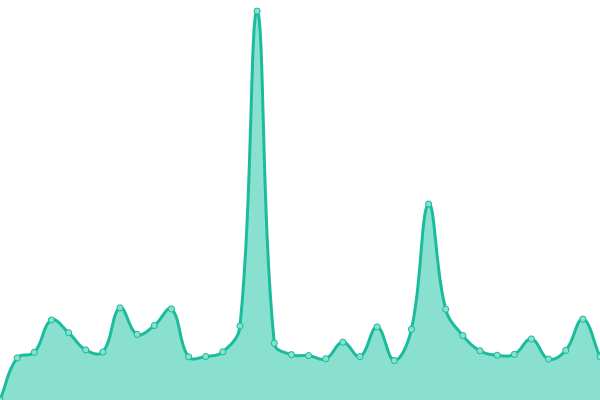

This repository contains the open-source uptime monitor and status page for PubliOne websites, powered by [Upptime](https://github.com/upptime/upptime).

---

<!--start: status pages-->
<!-- This summary is generated by Upptime (https://github.com/upptime/upptime) -->
<!-- Do not edit this manually, your changes will be overwritten -->
<!-- prettier-ignore -->
| URL | Status | History | Response Time | Uptime |
| --- | ------ | ------- | ------------- | ------ |
|  [PubliOne](https://publione.it) | 🟩 Up | [publi-one.yml](https://github.com/LucaRosaldi/p1-uptime-robot/commits/HEAD/history/publi-one.yml) | 

 1068ms
     
 | 

<a href="https://LucaRosaldi.github.io/p1-uptime-robot/history/publi-one">99.65%</a>
    

|  [Casta](https://casta.com) | 🟩 Up | [casta.yml](https://github.com/LucaRosaldi/p1-uptime-robot/commits/HEAD/history/casta.yml) | 

 1046ms
     
 | 

<a href="https://LucaRosaldi.github.io/p1-uptime-robot/history/casta">81.99%</a>
    

<!--end: status pages-->

[**Status website →**](https://lucarosaldi.github.io/p1-uptime-robot/)

## 📄 License

- Powered by: [Upptime](https://github.com/upptime/upptime)
- Code: [MIT](./LICENSE) © [Upptime](https://upptime.js.org)
- Data in the `./history` directory: [Open Database License](https://opendatacommons.org/licenses/odbl/1-0/)
